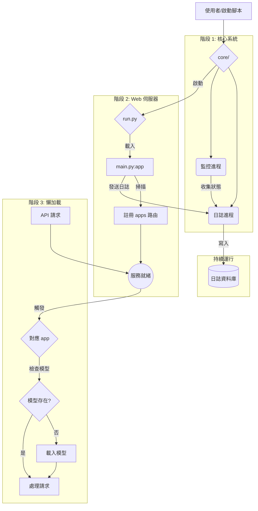

# 系統架構設計報告

**版本：1.0**
**日期：2025年7月25日**

## 1. 專案概述

本報告旨在為一個高效能、可擴展的 Web 應用程式，設計一套現代化、可維護的後端架構。此架構的核心目標是實現模組化、環境解耦與高效能的資源管理，確保專案不僅能在 Colab 環境中便捷地展示與運行，也能無縫部署至標準的 Ubuntu 生產環境，同時提供極佳的開發與除錯體驗。

設計遵循四大核心原則：

- **關注點分離 (Separation of Concerns)**：每個模組只做一件事，並把它做好。
- **依賴注入 (Dependency Injection)**：核心邏輯與特定環境（如 Colab UI）解耦。
- **非同步日誌系統 (Asynchronous Logging)**：高效能、無阻塞地記錄應用與系統狀態，避免寫入瓶頸。
- **分階段懶啟動 (Phased/Lazy Startup)**：實現服務秒級啟動，並在需要時才載入重度資源。

## 2. 系統架構：模組化設計

本架構將系統拆分為一系列高內聚、低耦合的模組。各模組職責分明，如下表所示：

| 模組/檔案名稱             | 核心職責 (Core Responsibility)                                       | 關鍵技術與模式                                                       |
| ------------------------- | -------------------------------------------------------------------- | -------------------------------------------------------------------- |
| `core/`                   | **進程指揮官 (目錄)**：啟動、監控並管理所有後端進程。                  | 多進程管理 (`multiprocessing`, `subprocess`)、進程生命週期控制。       |
| `run.py`                  | **本地開發啟動動畫播放器**：用於本地開發，模擬一個詳細的啟動序列並透過 WebSocket 廣播事件。**不適用於生產或 Colab 環境。** | `websockets`, `asyncio`。                                            |
| `server_main.py`          | **核心服務啟動器**：極簡的、阻塞式的伺服器啟動腳本，用於生產和 Colab 環境，確保服務長期運行。 | `uvicorn`, `argparse`。                                              |
| `main.py`                 | **應用主入口**：建立 FastAPI 實例，動態掃描並聚合所有 `apps` 的 API 路由。 | FastAPI 路由管理 (`include_router`)、動態模組匯入 (`importlib`)。     |
| `apps/*`                  | **業務邏輯單元**：包含所有具體應用功能（如量化、語音轉錄）的獨立模組。 | 業務邏輯、懶加載模式 (Lazy Loading)。                                |
| `colab_run.py`            | **Colab 顯示層管理器**：作為 Colab 的唯一接口，採用「介面優先」架構。主線程負責立即渲染 HTML 儀表板，並將所有耗時操作（建立 venv、安裝依賴、啟動服務）委派給一個背景工作線程。 | `IPython.display`、多執行緒 (`threading`)、`subprocess`。             |
| `logger/main.py`          | **中央日誌中心**：由一個日誌消費者進程，負責將日誌批次寫入資料庫。     | 非同步佇列 (`multiprocessing.Queue`)、單一寫入者模式 (Single Writer)。 |
| `database/`               | **日誌與指標資料庫**：儲存所有結構化的日誌與系統監控數據。             | DuckDB (或 SQLite)，高效批次寫入。                                    |
| `templates/dashboard.html`| **本地啟動儀表板**：由 `run.py` 使用的 HTML 範本，用於展示啟動動畫。     | HTML/CSS/JS、WebSocket 客戶端。                                      |
| `start.sh`                | **生產啟動腳本**：用於在伺服器環境中以後台模式啟動、停止和管理應用。   | Shell Scripting、守護進程管理。                                      |
| `start_in_venv.sh`        | **虛擬環境啟動器**：一個快速啟動腳本，確保在虛擬環境中安裝依賴並運行服務。 | Shell Scripting、`venv`、`uv`。                                        |
| `setup_and_test.sh`       | **全環境安裝與驗證器**：用於開發和 CI/CD 的核心腳本，負責建立全新環境、安裝依賴、執行檢查與測試。 | Shell Scripting、`venv`、`ruff`、`pytest`。                           |
| `check_disk_space.sh`     | **磁碟空間檢查器**：一個簡單的輔助工具，用於顯示當前的磁碟空間使用情況。 | `df -h`。                                                            |
| `tests/`                  | **自動化測試**：包含單元測試與整合測試，確保程式碼品質。             | `pytest`, `httpx`, `pytest-cov`。                                    |
| `pyproject.toml`          | **專案設定與工具鏈核心**：定義專案元數據、依賴、以及所有品質保證工具 (Ruff, Mypy, Pytest) 的設定。 | TOML 格式、Python 標準。                                             |

## 3. 系統執行順序 (Master Boot Sequence)

系統的啟動是一個精心設計的、分階段的過程，確保了穩定性與使用者體驗。



**詳細說明**

1.  **階段一：啟動器執行**
    由使用者或自動化腳本 (`start.sh`, `setup_and_test.sh`, 或 Colab Notebook) 觸發。它的核心任務是準備環境。

2.  **階段二：核心系統點火 (生產環境)**
    在生產環境中，`start.sh` 會呼叫 `core/` 模組。`core/` 作為總指揮官啟動，它首先建立後勤系統：啟動獨立的「日誌寫入進程」和「系統監控進程」。然後以子進程的方式啟動主應用程式，並全面監控其運行。

3.  **階段三：Web 伺服器上線**
    `uvicorn` 載入 `main.py`。FastAPI 應用程式實例被建立，並快速掃描所有 `apps/*` 目錄，將其 API 路由註冊完畢。此階段極快，完成後，伺服器即可接收請求，但記憶體佔用極低，因為任何大型資源（如 AI 模型）都尚未載入。

4.  **階段四：懶加載觸發**
    當第一個指向特定功能的 API 請求到達時（例如上傳一個音訊檔），對應的業務邏輯被觸發。此時，程式會檢查所需的大型模型是否已在記憶體中。如果是首次呼叫，則執行一次性的載入作業，並將模型儲存在全域變數中。後續所有請求都將直接使用這個已載入的模型，實現快速回應。

5.  **Colab 環境下的特殊流程**
    在 Colab 中，啟動流程由 `Colab_Guide.md` 中的儲存格觸發。該儲存格呼叫 `colab_run.py`，此腳本包含一個特殊設計的 `PrecisionIndicator` 類別，作為一個純文字、多區塊的儀表板渲染引擎。

    其運作流程如下：
    - **主線程 (Main Thread):**
        1.  **立即渲染:** 執行 `display(HTML(...))`，在幾秒內將 `dashboard.html` 的內容呈現給使用者。
        2.  **啟動背景線程:** 建立並啟動一個 `threading.Thread`，其目標是執行所有耗時的後端準備工作。
        3.  **等待中斷:** 主線程 `join()` 等待背景線程結束，或捕捉 `KeyboardInterrupt` 以便優雅地關閉系統。

    - **背景線程 (Work Thread):**
        1.  **建立虛擬環境:** 檢查 `.venv` 是否存在，若無則執行 `python -m venv .venv`。
        2.  **安裝依賴:** 使用 `.venv/bin/uv` 根據 `requirements/colab.txt` 安裝所有必要的套件。
        3.  **啟動核心服務:** 執行 `.venv/bin/python server_main.py`，在一個新的子進程中啟動 FastAPI 伺服器。
        4.  **進入監控迴圈:** 開始一個無限迴圈，定期從 `psutil` 收集系統資源數據、從伺服器子進程讀取日誌，並透過 `IPython.display.Javascript` 將這些數據即時推送到前端儀表板。

    這種非同步、解耦的架構，完美地解決了 Colab 環境下啟動時間過長導致的使用者體驗問題，實現了「瞬時反應駕駛艙」的核心目標。

    ```mermaid
    graph TD
        subgraph Colab Notebook Cell
            A[使用者點擊 "Run"] --> B[colab_run.py];
        end

        subgraph B [主線程 Main Thread]
            B1[渲染 dashboard.html] --> B2[啟動背景線程];
            B2 --> B3[等待 KeyboardInterrupt];
        end

        subgraph Work Thread [背景線程 Work Thread]
            C[建立 .venv] --> D[安裝依賴];
            D --> E[啟動 server_main.py];
            E --> F[進入監控與更新迴圈];
        end

        B2 -- start --> C;
        F -- JS Call --> B1;
    ```

## 4. 依賴與虛擬環境管理

為了實現環境的隔離與可重現性，我們採用標準化的 `venv` 與分層的 `requirements` 管理策略，並由 `pyproject.toml` 進行集中配置。

| 檔案名稱                  | 用途                                                                     | 安裝時機與方法                                                      |
| ------------------------- | ------------------------------------------------------------------------ | ------------------------------------------------------------------- |
| `pyproject.toml`          | **專案核心設定**：定義專案元數據、建置依賴，並集中管理所有開發工具 (linter, tester, etc.) 的設定。 | 專案的基礎，被 `pip` 和 `uv` 等工具自動讀取。                       |
| `.venv/`                  | **虛擬環境**：一個獨立、乾淨的 Python "氣泡"，用於隔離專案依賴。          | 在專案初始化時，使用 `python -m venv .venv` 建立一次。            |
| `requirements/base.txt`   | **核心依賴**：應用程式在任何環境運行的必需品 (`fastapi`, `duckdb` 等)。    | 生產環境部署時 (`uv pip install -r requirements/base.txt`)。          |
| `requirements/dev.txt`    | **開發依賴**：包含核心依賴，並額外增加測試、除錯與品質檢查工具。         | 開發者設定本地環境時 (`uv pip install -r requirements/dev.txt`)。   |
| `requirements/colab.txt`  | **Colab 特定依賴**：包含核心依賴，並額外增加 Colab UI 互動套件。         | 在 Colab Notebook 啟動時 (`uv pip install -r requirements/colab.txt`)。 |

## 5. 結論

本架構設計方案透過模組化、進程隔離、非同步處理與懶加載等現代軟體工程實踐，構建了一個高效、穩定且高度可維護的系統。它不僅解決了日誌寫入的並發問題和重資源啟動慢的痛點，還透過清晰的依賴管理和啟動順序，確保了在不同環境下的一致性與可重現性，為專案的長期發展奠定了堅實的基礎。
