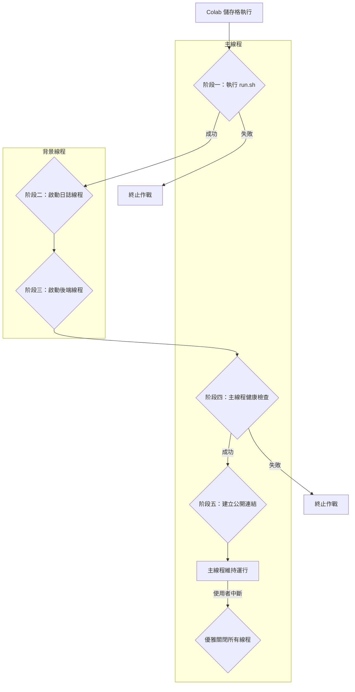

# 鳳凰之心作戰平台 v2.1.0 架構說明：單線程堡壘

呈報對象： 指揮官
報告日期： 2025 年 7 月 23 日
版本號： v2.1.0

## I. 核心理念：絕對可靠的順序執行

本專案採用「單線程堡壘」架構，旨在根除在 Colab 等資源受限環境中，由多進程或多線程引起的競爭條件和不確定性。其核心理念是回歸本源，採用最簡單、最可靠的單線程、順序執行流程，以確保 100% 的日誌可見性和部署成功率。

## II. 啟動流程：單一入口，鐵序執行

系統的唯一入口點是 `integrated_platform/src/colab_bootstrap.py`。其 `main()` 函式嚴格遵循以下順序執行，任何一步失敗都會導致流程終止，確保了執行的可預測性。

### 階段一：阻塞式前景安裝

*   **執行者**: 主線程
*   **動作**: 直接呼叫並等待 `run.sh` 腳本執行完畢。`run.sh` 的唯一職責是使用 `pip install -r requirements.txt` 安裝所有依賴。
*   **目的**: 確保在執行任何 Python 程式碼之前，執行環境是完全準備好的。此階段的任何輸出都會直接顯示在 Colab 的輸出欄位，提供完全透明的安裝過程。若安裝失敗，整個作戰流程將立即終止。

### 階段二：啟動日誌與儀表板

*   **執行者**: 主線程初始化，儀表板在獨立的背景線程 (`DisplayManagerThread`) 運行。
*   **動作**:
    1.  在所有依賴都安全安裝後，才導入 `IPython`、`google.colab` 等可能需要安裝的模組。
    2.  初始化 `LogManager`，負責將日誌寫入 `logs.sqlite`。
    3.  啟動 `DisplayManager` 的背景線程，該線程會持續從資料庫讀取日誌，並更新 Colab UI。
*   **目的**: 確保日誌系統在後端服務啟動前就緒，能夠捕捉到後續所有的啟動日誌。

### 階段三：啟動後端核心引擎

*   **執行者**: 獨立的背景線程 (`BackendServerThread`)
*   **動作**: 透過 `uvicorn` 啟動 FastAPI 應用。
*   **目的**: 將長時間運行的後端服務與主線程分離，避免阻塞。

### 階段四：主線程健康檢查

*   **執行者**: 主線程
*   **動作**: 循環向後端服務的 `/health` 端點發送請求，直到收到成功的響應或超時。
*   **目的**: 確保只有在後端服務完全就緒後，才執行後續步驟。

### 階段五：建立對外通訊

*   **執行者**: 主線程
*   **動作**: 呼叫 `google.colab.output.serve_kernel_port_as_iframe` 建立公開的訪問連結。
*   **目的**: 將穩定的服務暴露給使用者。

### 階段六：維持運行與優雅關閉

*   **執行者**: 主線程
*   **動作**: 主線程進入一個循環，監聽 `STOP_EVENT`。當使用者在 Colab 中斷儲存格執行時，`STOP_EVENT` 被設置，`finally` 塊會被觸發，從而優雅地清理所有背景線程。
*   **目的**: 確保資源的正確釋放。

## III. 流程圖與資料流

### A. 流程圖

### B. 資料流

| 編號 | 來源組件         | 目標組件             | 傳遞的資料                               | 傳遞方式     | 說明                                                                 |
| :--- | :--------------- | :------------------- | :--------------------------------------- | :----------- | :------------------------------------------------------------------- |
| 1    | Colab 儲存格     | `colab_bootstrap.py` | `LOG_DISPLAY_LINES`, `FASTAPI_PORT` 等   | 全域變數     | Colab 儲存格在呼叫 `main()` 之前，直接設定 `colab_bootstrap` 模組中的全域變數。 |
| 2    | 所有組件         | `LogManager`         | 日誌訊息 (level, message)                | 函式呼叫     | 系統各部分透過呼叫 `log_manager.log()` 來記錄事件。                    |
| 3    | `LogManager`     | `logs.sqlite`        | 格式化的日誌記錄                         | SQLite 寫入  | `LogManager` 將日誌持久化到資料庫中。                                |
| 4    | `logs.sqlite`    | `DisplayManager`     | 新的日誌記錄                             | SQLite 讀取  | `DisplayManager` 定期查詢資料庫以獲取新日誌，並更新 UI。             |
| 5    | `colab_bootstrap.py` | FastAPI 應用 (`app`) | `log_manager` 實例                       | `app.state`  | 主引導程序將 `log_manager` 實例注入到 FastAPI 應用的狀態中，供其內部使用。 |

## IV. 核心優勢

*   **穩定性**: 徹底消除了競爭條件。依賴安裝、日誌系統、後端服務的啟動順序是固定且可靠的。
*   **透明度**: `pip install` 的日誌會直接、完整地顯示在 Colab 輸出中，便於診斷環境問題。
*   **日誌完整性**: 日誌儀表板在後端啟動前就已運行，可以捕獲從啟動到運行的所有日誌，不會再出現日誌被清空或丟失的問題。
*   **易於維護**: 單一、線性的啟動流程取代了複雜的多進程管理，使程式碼更容易理解和除錯。
