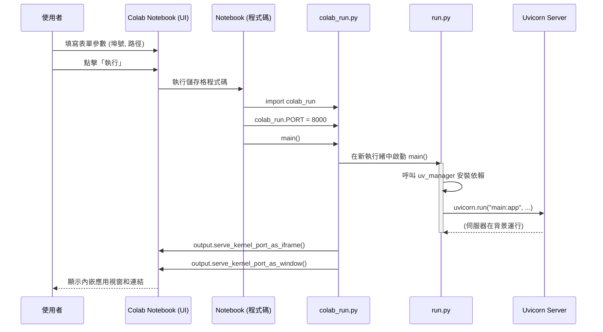

# 鳳凰之心作戰平台架構說明

呈報對象： 指揮官
報告日期： 2025 年 7 月 23 日
版本號： v3.0.0 (Colab-Native)

## I. 核心理念：Colab 原生，簡潔至上

本專案架構已演進為「Colab 引導層」模型。此模型專為在 Google Colab 環境中實現最大的穩定性、易用性和可維護性而設計。我們摒棄了複雜的腳本和多線程管理，回歸到由 Colab Notebook 直接驅動的、清晰的單一流程。

核心理念是：**讓 Colab Notebook 作為使用者互動的前端和參數設定的入口，同時讓 Python 腳本 (`colab_run.py`, `run.py`) 專注於核心的應用程式邏輯。**

## II. 組件與職責

### 1. Colab Notebook (`.ipynb`) - 指揮中心
*   **職責**:
    1.  **使用者介面 (UI)**: 提供一個基於 `@param` 的表單，讓使用者可以直觀地設定關鍵參數（如專案路徑、埠號等）。
    2.  **環境設定**: 負責設定正確的工作目錄 (`os.chdir`) 和 Python 的模組搜尋路徑 (`sys.path`)。
    3.  **參數傳遞**: 將使用者在表單中設定的值，在執行階段直接賦予給 `colab_run.py` 模組中的全域變數。
    4.  **啟動入口**: 呼叫 `colab_run.main()`，觸發整個應用程式的啟動流程。
*   **定位**: 專案的**最高層引導器 (Top-Level Bootstrapper)**。

### 2. `colab_run.py` - Colab 環境適配層
*   **職責**:
    1.  **接收參數**: 作為一個 Python 模組，從 Colab Notebook 接收設定值（如 `PORT`）。
    2.  **背景化應用**: 在一個獨立的背景執行緒 (`daemon=True`) 中啟動主應用程式 (`run.main`)。這是必要的，因為主執行緒需要繼續執行以呼叫 Colab 的代理功能。
    3.  **建立內部通道**: 呼叫 `google.colab.output.serve_kernel_port_as_iframe` 和 `serve_kernel_port_as_window`，生成只有使用者可見的、安全的應用程式訪問連結。
    4.  **維持運行**: 讓主執行緒保持活躍，以確保背景的 FastAPI 服務和 Colab 的代理通道能持續運作。
*   **定位**: **Colab 環境與核心應用的橋樑**。它處理所有 Colab 特有的 API 呼叫和執行緒管理。

### 3. `run.py` - 主應用邏輯層
*   **職責**:
    1.  **依賴管理**: 呼叫 `uv_manager.install_dependencies()` 來確保所有必要的 Python 套件都已安裝。
    2.  **參數解析**: 使用 `argparse.parse_known_args()` 來處理命令列參數。這種方式可以安全地忽略由 Colab/Jupyter 傳入的未知參數，從而避免崩潰。
    3.  **啟動 Web 伺服器**: 使用 `uvicorn.run()` 來啟動 FastAPI 應用 (`main:app`)。
*   **定位**: **核心應用啟動器**。它的設計是環境無關的，理論上也可以在本地或其他非 Colab 環境中執行。

### 4. `uv_manager.py` - 依賴管理工具
*   **職責**: 封裝了使用 `uv` 來安裝 `requirements.txt` 的所有邏輯。
*   **定位**: **專用的套件安裝工具**。

## III. 啟動流程與資料流

### A. 啟動時序圖

### B. 資料流

| 編號 | 來源組件         | 目標組件         | 傳遞的資料     | 傳遞方式     | 說明                                                     |
| :--- | :--------------- | :--------------- | :------------- | :----------- | :------------------------------------------------------- |
| 1    | Colab Notebook   | `colab_run.py`   | `PORT` 等設定  | 模組全域變數 | Colab Notebook 在 `import` 後，直接對模組的變數進行賦值。 |
| 2    | `colab_run.py`   | `run.py`         | (無直接傳遞)   | 函式呼叫     | `colab_run` 啟動 `run`，`run` 使用自己的預設參數。      |
| 3    | `run.py`         | `main:app`       | `host`, `port` | Uvicorn 參數 | `run.py` 將解析後的參數傳遞給 `uvicorn.run`。          |

## IV. 核心優勢

*   **易用性**: 使用者只需填寫一個簡單的表單即可啟動，無需理解底層程式碼。
*   **穩定性**: `parse_known_args()` 的使用解決了在 Colab 環境中常見的參數衝突問題。啟動流程清晰，減少了出錯的可能性。
*   **安全性**: 預設使用 Colab 的內部代理，服務不會暴露在公共網路上，只有筆記本的使用者可以訪問。
*   **可維護性**: 職責劃分清晰。UI 和參數設定在 `.ipynb`，Colab 環境適配在 `colab_run.py`，核心應用邏輯在 `run.py`，使得各部分可以獨立修改和維護。
