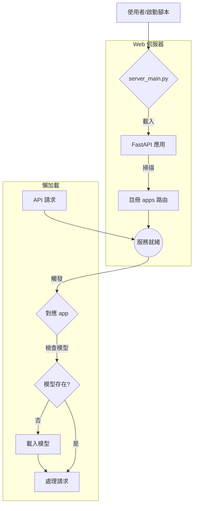

# 系統架構設計報告

**版本：3.0**
**日期：2025年7月26日**

## 1. 專案概述

本報告旨在為「鳳凰之心」專案設計一套現代化、可維護的後端架構。此架構的核心目標是實現模組化、環境解耦與高效能的資源管理，確保專案不僅能在 Colab 環境中便捷地展示與運行，也能無縫部署至標準的生產環境。

設計遵循三大核心原則：

- **關注點分離 (Separation of Concerns)**：每個模組只做一件事，並把它做好。
- **依賴注入 (Dependency Injection)**：核心邏輯與特定環境（如 Colab UI）解耦。
- **資源懶加載 (Lazy Loading)**：實現服務秒級啟動，並在需要時才載入重度資源。

## 2. 系統架構：模組化設計

本架構將系統拆分為一系列高內聚、低耦合的模組。各模組職責分明，如下表所示：

| 模組/檔案名稱               | 核心職責 (Core Responsibility)                                       | 關鍵技術與模式                                                       |
| --------------------------- | -------------------------------------------------------------------- | -------------------------------------------------------------------- |
| `server_main.py`            | **應用主入口**：建立 FastAPI 實例，動態掃描並聚合所有 `apps` 的 API 路由。 | FastAPI 路由管理 (`include_router`)。     |
| `apps/*`                    | **業務邏輯單元**：包含所有具體應用功能（如量化、語音轉錄）的獨立模組。 | 業務邏輯、懶加載模式 (Lazy Loading)。                                |
| `run.py`                    | **Colab 顯示層管理器**：在 Colab 環境中啟動一個儀表板，用於監控系統。 | `IPython.display`、多執行緒 (`threading`)。             |
| `core/`                     | **核心模組 (目錄)**：提供專案所需的核心功能。                          |                                                                      |
| `core/logging_config.py`    | **日誌設定**：提供標準化的日誌設定功能。                             | `logging` 模組。                                                     |
| `core/presentation_manager.py` | **視覺指揮官**：管理 Colab 儀表板的顯示。                            | ANSI 終端控制碼。                                                    |
| `core/monitor.py`           | **硬體監控器**：監控 CPU 和 RAM 使用率。                               | `psutil` 模組。                                                      |
| `templates/dashboard.html`  | **儀表板模板**：由 `server_main.py` 使用的 HTML 範本。                 | HTML/CSS。                                                           |
| `setup.sh`                  | **全環境安裝與驗證器**：用於開發和 CI/CD 的核心腳本。                  | Shell Scripting、`venv`、`ruff`、`pytest`。                           |
| `e2e_test.sh`               | **端到端測試**：啟動伺服器並測試所有 API 端點。                        | Shell Scripting、`httpx`。                                           |
| `tests/`                    | **自動化測試**：包含單元測試與整合測試。                             | `pytest`, `httpx`, `pytest-cov`。                                    |
| `pyproject.toml`            | **專案設定與工具鏈核心**：定義專案元數據、依賴及工具設定。             | TOML 格式、Python 標準。                                             |

## 3. 系統執行順序

系統的啟動是一個簡單直接的過程。



**詳細說明**

1.  **啟動**
    由使用者或自動化腳本 (`setup.sh`, `e2e_test.sh`) 觸發。

2.  **Web 伺服器上線**
    `uvicorn` 載入 `server_main.py`。FastAPI 應用程式實例被建立，並快速掃描所有 `apps/*` 目錄，將其 API 路由註冊完畢。

3.  **懶加載觸發**
    當第一個指向特定功能的 API 請求到達時，對應的業務邏輯被觸發。此時，程式會檢查所需的大型模型是否已在記憶體中。如果是首次呼叫，則執行一次性的載入作業。

4.  **Colab 環境下的特殊流程**
    在 Colab 中，啟動流程由 `run.py` 中的 `display_dashboard` 函式觸發。

    ```mermaid
    graph TD
        subgraph Colab Notebook Cell
            A[使用者執行 display_dashboard()] --> B[run.py];
        end

        subgraph B [主線程 Main Thread]
            B1[渲染儀表板] --> B2[啟動硬體監控];
            B2 --> B3[模擬日誌流];
        end
    ```

## 4. 依賴與虛擬環境管理

為了實現環境的隔離與可重現性，我們採用標準化的 `venv` 與分層的 `requirements` 管理策略。

| 檔案名稱                  | 用途                                                                     |
| ------------------------- | ------------------------------------------------------------------------ |
| `pyproject.toml`          | **專案核心設定**：定義專案元數據、建置依賴及工具設定。                     |
| `.venv/`                  | **虛擬環境**：一個獨立、乾淨的 Python "氣泡"，用於隔離專案依賴。          |
| `requirements/base.txt`   | **核心依賴**：應用程式在任何環境運行的必需品。                           |
| `requirements/dev.txt`    | **開發依賴**：包含核心依賴，並額外增加測試、除錯與品質檢查工具。         |
| `requirements/colab.txt`  | **Colab 特定依賴**：包含核心依賴，並額外增加 Colab UI 互動套件。         |

## 5. 結論

本架構設計方案透過模組化、非同步處理與懶加載等現代軟體工程實踐，構建了一個高效、穩定且高度可維護的系統。它不僅解決了重資源啟動慢的痛點，還透過清晰的依賴管理和啟動順序，確保了在不同環境下的一致性與可重現性，為專案的長期發展奠定了堅實的基礎。
