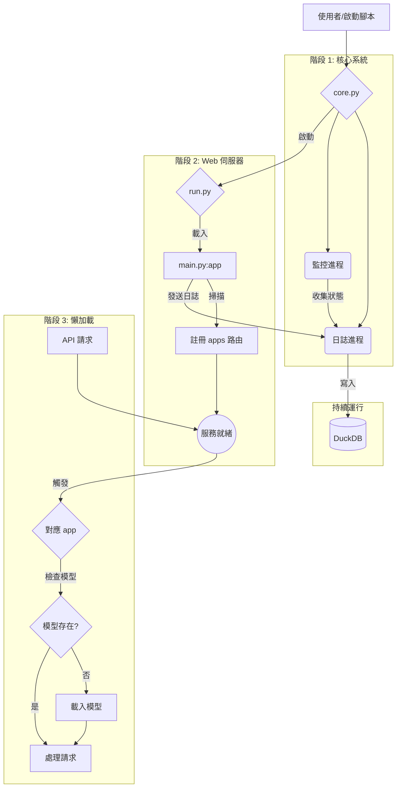

# 系統架構設計報告

**版本：1.0**
**日期：2025年7月25日**

## 1. 專案概述

本報告旨在為一個高效能、可擴展的 Web 應用程式，設計一套現代化、可維護的後端架構。此架構的核心目標是實現模組化、環境解耦與高效能的資源管理，確保專案不僅能在 Colab 環境中便捷地展示與運行，也能無縫部署至標準的 Ubuntu 生產環境，同時提供極佳的開發與除錯體驗。

設計遵循四大核心原則：

- **關注點分離 (Separation of Concerns)**：每個模組只做一件事，並把它做好。
- **依賴注入 (Dependency Injection)**：核心邏輯與特定環境（如 Colab UI）解耦。
- **非同步日誌系統 (Asynchronous Logging)**：高效能、無阻塞地記錄應用與系統狀態，避免寫入瓶頸。
- **分階段懶啟動 (Phased/Lazy Startup)**：實現服務秒級啟動，並在需要時才載入重度資源。

## 2. 系統架構：模組化設計

本架構將系統拆分為一系列高內聚、低耦合的模組。各模組職責分明，如下表所示：

| 模組名稱 (.py)      | 核心職責 (Core Responsibility)                                       | 關鍵技術與模式                                                       |
| ------------------- | -------------------------------------------------------------------- | -------------------------------------------------------------------- |
| `core.py`           | **進程指揮官**：啟動、監控並管理所有後端進程（Web伺服器、日誌、監控）。 | 多進程管理 (`multiprocessing`, `subprocess`)、進程生命週期控制。       |
| `run.py`            | **伺服器啟動器**：一個極簡腳本，其唯一任務是使用 uvicorn 啟動 FastAPI 應用。 | Uvicorn ASGI 伺服器。                                                |
| `main.py`           | **應用主入口**：建立 FastAPI 實例，動態掃描並聚合所有 `apps` 的 API 路由。 | FastAPI 路由管理 (`include_router`)、動態模組匯入 (`importlib`)。     |
| `apps/*`            | **業務邏輯單元**：包含所有具體應用功能（如量化、語音轉錄）的獨立模組。 | 業務邏輯、懶加載模式 (Lazy Loading)。                                |
| `colab_run.py`      | **Colab 橋接器**：作為 Colab Notebook 與後端系統的唯一接口。           | 依賴注入模式、外觀模式 (Facade Pattern)。                            |
| `colab_display.py`  | **Colab 顯示器**：包含所有與 Colab UI 互動的程式碼，渲染 HTML 狀態介面。 | `IPython.display`、HTML/CSS/JS。                                     |
| `logger/main.py`    | **中央日誌中心**：由一個日誌消費者進程，負責將日誌批次寫入資料庫。     | 非同步佇列 (`multiprocessing.Queue`)、單一寫入者模式 (Single Writer)。 |
| `database/`         | **日誌與指標資料庫**：儲存所有結構化的日誌與系統監控數據。             | DuckDB 分析型欄式資料庫 (OLAP)、高效批次寫入。                       |
| `start.sh`          | **生產啟動腳本**：用於在伺服器環境中以後台模式啟動、停止和管理應用。   | Shell Scripting、守護進程管理。                                      |
| `tests/`            | **自動化測試**：包含單元測試與整合測試，確保程式碼品質。             | `pytest`, `httpx`, `pytest-cov`。                                    |
| `pre-commit`        | **品質預檢系統**：在提交前自動執行風格、型別與安全檢查。               | `ruff`, `mypy`, `bandit`。                                           |

## 3. 系統執行順序 (Master Boot Sequence)

系統的啟動是一個精心設計的、分階段的過程，確保了穩定性與使用者體驗。

**詳細說明**

1.  **階段一：啟動器執行**
    由使用者或自動化腳本 (`start.sh` 或 `colab_run.py`) 觸發。它的核心任務是準備環境，並以正確的參數呼叫 `core.py`。

2.  **階段二：核心系統點火**
    `core.py` 作為總指揮官啟動。它首先建立後勤系統：啟動獨立的「日誌寫入進程」和「系統監控進程」。這兩個進程開始獨立工作後，`core.py` 才會以子進程的方式啟動主應用程式 `run.py`，並全面監控其運行。

3.  **階段三：Web 伺服器上線**
    `run.py` 啟動 `uvicorn`，`uvicorn` 載入 `main.py`。FastAPI 應用程式實例被建立，並快速掃描所有 `apps/*` 目錄，將其 API 路由註冊完畢。此階段極快，完成後，伺服器即可接收請求，但記憶體佔用極低，因為任何大型資源（如 AI 模型）都尚未載入。

4.  **階段四：懶加載觸發**
    當第一個指向特定功能的 API 請求到達時（例如上傳一個音訊檔），對應的業務邏輯被觸發。此時，程式會檢查所需的大型模型是否已在記憶體中。如果是首次呼叫，則執行一次性的載入作業，並將模型儲存在全域變數中。後續所有請求都將直接使用這個已載入的模型，實現快速回應。

## 4. 依賴與虛擬環境管理

為了實現環境的隔離與可重現性，我們採用標準化的 `venv` 與分層的 `requirements` 管理策略。

| 檔案名稱                  | 用途                                                                     | 安裝時機與方法                                                      |
| ------------------------- | ------------------------------------------------------------------------ | ------------------------------------------------------------------- |
| `.venv/`                  | **虛擬環境**：一個獨立、乾淨的 Python "氣泡"，用於隔離專案依賴。          | 在專案初始化時，使用 `python -m venv .venv` 建立一次。            |
| `requirements/base.txt`   | **核心依賴**：應用程式在任何環境運行的必需品 (`fastapi`, `duckdb` 等)。    | 生產環境部署時 (`uv pip install -r requirements/base.txt`)。          |
| `requirements/dev.txt`    | **開發依賴**：包含核心依賴，並額外增加測試、除錯與品質檢查工具。         | 開發者設定本地環境時 (`uv pip install -r requirements/dev.txt`)。   |
| `requirements/colab.txt`  | **Colab 特定依賴**：包含核心依賴，並額外增加 Colab UI 互動套件。         | 在 Colab Notebook 啟動時 (`uv pip install -r requirements/colab.txt`)。 |

## 5. 結論

本架構設計方案透過模組化、進程隔離、非同步處理與懶加載等現代軟體工程實踐，構建了一個高效、穩定且高度可維護的系統。它不僅解決了日誌寫入的並發問題和重資源啟動慢的痛點，還透過清晰的依賴管理和啟動順序，確保了在不同環境下的一致性與可重現性，為專案的長期發展奠定了堅實的基礎。
