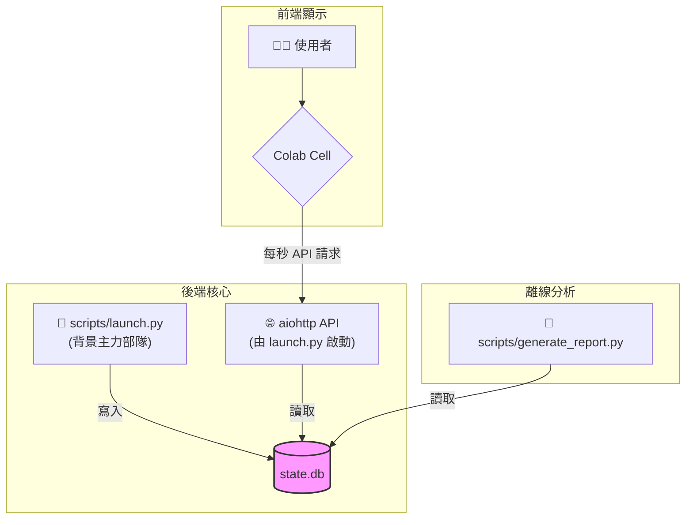

# 鳳凰之心 v17：權威性架構藍圖

這份文件是一份權威性的技術藍圖，旨在精準反映專案 v17 的最終形態。它不僅描繪了檔案結構和自動化流程，更深入闡述了其背後應對現代化開發挑戰的設計哲學與實踐經驗。

---

## 一、 核心設計哲學：從問題出發，持續演進

一個健壯的架構不是一次性設計出來的，而是圍繞著解決真實問題，不斷迭代演進的結果。我們的核心哲學是：**先求穩定，再求高效，最後追求智慧**。

### **遇到的三大核心困境 (The Three Bottlenecks)**
我們的架構是為了解決在現代 CI/CD 與自動化流程中普遍存在的三大瓶頸而設計的：
1.  **空間瓶頸 (硬碟空間耗盡)**: 在資源受限的容器化環境中，傳統「一次性安裝所有依賴」的流程極易導致硬碟空間不足而失敗。
2.  **時間瓶頸 (CPU 資源浪費)**: 單線程的循序測試無法充分利用多核心 CPU，導致測試時間過長，嚴重拖慢開發迭代速度。
3.  **穩定性瓶頸 (流程意外掛起)**: 單一測試案例的意外卡死（如 API 等待、死循環）會導致整個 CI/CD 流程被無限期阻塞，無法自動報告錯誤。

### **對應的三大核心策略 (The Three Solutions)**
-   **策略一：原子化隔離與即時清理 (解決空間瓶頸)**
    我們將每個測試任務視為一個「原子」單元。透過 `core_utils/safe_installer.py`，在安裝依賴前，系統會先檢查資源。測試前，僅為其建立一個包含最小依賴集的專用虛擬環境；測試結束後，立即徹底刪除該環境，將硬碟空間 100% 釋放。這確保了資源峰值佔用永遠在可控範圍內。

-   **策略二：輕量級多核心平行處理 (解決時間瓶頸)**
    我們透過 `smart_e2e_test.py` 中的 `multiprocessing` 實現應用級平行 (同時測試多個 App)，並利用 `pytest-xdist` 在每個 App 內部實現測試級平行。這套輕量級方案能在不增加空間負擔的前提下，壓榨 CPU 性能，大幅縮短測試總耗時。

-   **策略三：主動式超時強制中斷 (解決穩定性瓶頸)**
    我們為每一個測試案例都設定了一個「生命時鐘」（透過 `pytest-timeout`）。任何超時的測試都會被自動中斷並標記為失敗，確保 CI/CD 流程永遠不會被單一故障點所阻塞。

---

## 二、 v18 檔案結構與核心工具鏈

這是專案的最終檔案結構，精準反映了所有關鍵組件及其職責（v18 版，已重構）。

```
.
├── README.md
├── WEB1
│   └── config.json
├── apps
│   ├── dashboard_api
│   ├── main_dashboard
│   ├── quant
│   └── transcriber
├── config
│   └── resource_settings.yml
├── core_utils
│   ├── __init__.py
│   ├── commander_console.py
│   ├── resource_monitor.py
│   └── safe_installer.py
├── docs
│   ├── ARCHITECTURE.md
│   ├── Colab_Guide.md
│   ├── MISSION_DEBRIEFING.md
│   └── TEST.md
├── logs
├── pytest.ini
├── requirements-dev.in
├── requirements-dev.txt
├── run
│   └── colab_runner.py
├── scripts
│   ├── __init__.py
│   ├── estimate_deps_size.py
│   ├── generate_report.py
│   ├── launch.py
│   ├── phoenix_starter.py
│   └── smart_e2e_test.py
├── temp
└── tests
    ├── conftest.py
    ├── quant
    ├── test_e2e_dashboard.py
    ├── test_estimate_deps_size.py
    ├── test_launch_installer.py
    ├── test_resource_protection.py
    └── transcriber
```

### **核心目錄與檔案詳解:**

*   **`README.md`**: 專案的入口文件，提供高層次的概覽和快速上手指南。
*   **`apps/`**: **微服務應用目錄**。每個子目錄都是一個獨立的 FastAPI 應用，擁有自己的 `requirements.txt`。這種模組化設計使得每個服務都可以被獨立開發、測試和部署。
*   **`config/`**: **全域設定中心**。存放專案範圍的設定檔，例如 `resource_settings.yml`，用於控制資源監控的閾值。
*   **`core_utils/`**: **核心工具模組**。專案的「引擎室」，提供共享的底層功能。
    *   `safe_installer.py`: 原子化的安全安裝程序，確保在安裝依賴前檢查系統資源，並在安裝後即時清理，解決了 CI/CD 環境中的空間瓶頸。
    *   `commander_console.py`: 負責 TUI (文字使用者介面) 的渲染與日誌顯示。
    *   `resource_monitor.py`: 提供跨平台的系統資源 (CPU, RAM) 監控功能。
*   **`docs/`**: **專案文件庫**。包含此架構藍圖、Colab 使用指南和其他重要的技術文件。
*   **`logs/`**: **日誌與報告目錄**。所有由 `launch.py` 和 `generate_report.py` 產生的日誌和 Markdown 報告都會存放在這裡。
*   **`run/`**: **特定環境執行器**。
    *   `colab_runner.py`: 專為 Google Colab 設計的啟動器，提供一個視覺化的 HTML 儀表板來監控後端進程。
*   **`scripts/`**: **主要腳本與工具**。這是所有使用者可直接執行的主要工具的家。
    *   `launch.py`: 專案的**核心入口**。負責啟動 TUI 介面、協調後端服務、監控資源，並在結束時觸發報告生成。
    *   `smart_e2e_test.py`: **智能測試指揮官**。使用 Python 的 `multiprocessing` 實現了高效的平行化測試，並整合了超時控制，確保了測試流程的穩定性。
    *   `generate_report.py`: 獨立的**報告生成插件**。由 `launch.py` 在任務結束時呼叫，從資料庫中讀取數據並產生分析報告。
    *   `estimate_deps_size.py`: **依賴大小估算工具**。一個輔助工具，可以在不實際安裝的情況下，預估 `requirements.in` 檔案的完整依賴樹的總下載大小，有助於評估部署成本。
*   **`tests/`**: **品質保證中心**。包含所有 `pytest` 單元測試、整合測試和端對端測試。

---

## 三、 Colab 啟動器與 API 最終架構：資料庫驅動方案

### 核心概念：讀寫分離與單一真相來源
我們將**「做事」與「顯示」**完全分離。
1.  **寫入方 (`launch.py`)**: 作為後端主力部隊，`launch.py` 專心執行所有任務（安裝、啟動 App 等），並將所有狀態與日誌**持續寫入**唯一的真相來源：一個獨立的 **SQLite 資料庫 (`state.db`)**。
2.  **讀取方 (`run/colab_runner.py` 或其他 API 客戶端)**: 前端顯示器（例如 Colab Cell）或任何需要監控狀態的工具，則專心**讀取**數據。`launch.py` 在啟動時，會一併啟動一個輕量級的 **aiohttp API 伺服器**。這個 API 伺服器的唯一職責就是從 SQLite 資料庫讀取最新狀態，並以 JSON 格式提供給前端。

兩者透過資料庫和一個只讀的 API 進行溝通，互不干擾，確保了後端任務的穩定執行不會被前端的任何問題所影響。

### 架構草圖


### 核心優勢
*   **極致穩定**：前端顯示的崩潰，完全不影響後端核心任務的執行。真相永遠保存在資料庫中。
*   **架構簡潔**：沒有任何額外的網路服務 (GoTTY, WebSocket)，只有 Python、aiohttp 和 SQLite，除錯和維護成本降至最低。
*   **數據完整與可重用**：所有事件和狀態都被完整記錄。任務結束後，獨立的 `generate_report.py` 可以隨時從資料庫中重新產生完整的執行報告，用於分析或歸檔。

---

## 四、架構演進歷程：從錯誤中學習

本節記錄了專案在發展過程中遇到的關鍵挑戰以及對應的解決方案，這些經驗是專案寶貴的無形資產。

### 1. 問題：CI/CD 環境下的儀表板不穩定
- **遇到的狀況**: 在早期的版本中，我們嘗試使用 `GoTTY` 或直接將 `launch.py` 的 TUI 輸出（包含大量 ANSI escape codes）串流到前端。這種方法非常脆弱，任何 TUI 渲染的微小錯誤、甚至是網路延遲，都會導致整個流程崩潰或卡死。
- **失敗的嘗試**: 繼續優化 TUI 輸出，試圖用更複雜的控制字元來解決問題。這讓程式碼變得愈加複雜且難以維護，治標不治本。
- **成功的解決方案 (v12)**: **引入資料庫驅動架構**。我們意識到問題的根源在於「執行」和「顯示」的耦合。透過讓 `launch.py` 只專注於將狀態寫入 SQLite，並讓前端只專注於從一個唯讀的 API 讀取數據，我們徹底切斷了兩者之間的直接聯繫，實現了極高的穩定性。

### 2. 問題：開發環境不一致與依賴地獄
- **遇到的狀況**: 開發者 A 在本地安裝了 `pandas v2.0`，測試通過；而開發者 B 安裝了 `pandas v2.1`，部分 API 行為發生變化導致測試失敗。這種「在我機器上可以跑」的問題嚴重影響了團隊協作效率。
- **失敗的嘗試**: 口頭約定大家使用相同的版本，或手動維護一個包含所有間接依賴的 `requirements.txt`。前者不可靠，後者極其繁瑣且容易出錯。
- **成功的解決方案 (v12+)**: **引入 `pip-tools` 進行依賴鎖定**。我們讓開發者只在 `requirements.in` 中聲明直接依賴，然後使用 `pip-compile` 命令自動生成包含所有層級依賴且版本被完全鎖定的 `requirements.txt`。這保證了任何環境下安裝的依賴都是完全一致的，根治了此問題。

### 3. 問題：報告系統與主邏輯耦合
- **遇到的狀況**: 最初，報告產生的邏輯是 `launch.py` 的一部分。這導致了幾個問題：
    1.  要測試報告功能，必須完整運行一次 `launch.py`，非常耗時。
    2.  報告邏輯的任何改動，都有可能意外影響到主程序的穩定性。
    3.  如果任務中途失敗，儲存下來的資料庫就無法被用來重新產生報告。
- **失敗的嘗試**: 在 `ReportGenerator` 類別中增加更多的錯誤處理，試圖隔離其影響。但這無法解決根本的耦合問題。
- **成功的解決方案 (v16)**: **報告系統插件化**。我們將報告邏輯完全移出，製作成一個獨立的 `generate_report.py` 命令列工具。`launch.py` 在結束時只負責呼叫這個腳本。這使得報告系統可以被獨立測試、獨立擴展，並且可以對任何符合格式的資料庫檔案執行，極大地增強了靈活性和可維護性。

### 4. 問題：核心依賴缺失導致執行失敗
- **遇到的狀況**: 在測試中發現，`generate_report.py` 在產生 Markdown 表格時，因缺少可選的 `tabulate` 套件而崩潰。
- **失敗的嘗試**: 僅在使用到該功能的地方加入 `try-except` 區塊。這雖然能防止崩潰，但會導致報告內容不完整，使用者體驗不佳。
- **成功的解決方案 (v17)**: **核心依賴前置檢查與自動安裝**。我們在 `launch.py` 和 `generate_report.py` 的入口處，加入了對所有核心依賴（包括 `pandas`, `tabulate`, `sparklines` 等）的檢查。如果發現缺少，腳本會嘗試自動安裝，若安裝失敗則會清晰地提示使用者如何手動安裝。這確保了腳本的開箱即用性，極大改善了使用者體驗。

---
