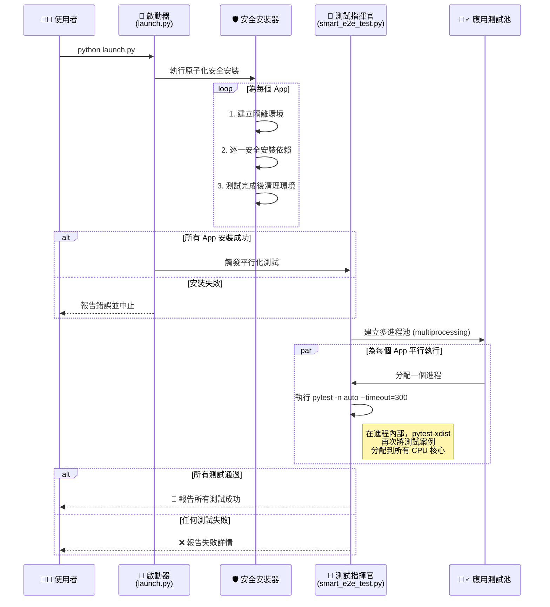

# 鳳凰之心 v9.2：權威性架構藍圖

這份文件是一份權威性的技術藍圖，旨在精準反映專案 v9.2 的最終形態。它不僅描繪了檔案結構和自動化流程，更深入闡述了其背後應對現代化開發挑戰的設計哲學。

---

## 一、 設計哲學：應對 CI/CD 的三重困境

我們的架構是為了解決在現代持續整合與部署 (CI/CD) 環境中普遍存在的三大核心瓶頸而設計的：

1.  **空間瓶頸 (硬碟空間耗盡)**: 在資源受限的容器化環境中，傳統「一次性安裝所有依賴」的流程極易導致硬碟空間不足而失敗。
2.  **時間瓶頸 (CPU 資源浪費)**: 單線程的循序測試無法充分利用多核心 CPU，導致測試時間過長，嚴重拖慢開發迭代速度。
3.  **穩定性瓶頸 (流程意外掛起)**: 單一測試案例的意外卡死（如 API 等待、死循環）會導致整個 CI/CD 流程被無限期阻塞，無法自動報告錯誤。

為此，我們確立了三大核心解決策略，它們共同構建了一個快速、穩健且高效的系統：

-   **策略一：原子化隔離與即時清理 (解決空間瓶頸)**
    我們將每個測試任務視為一個「原子」單元。測試前，僅為其建立一個包含最小依賴集的專用虛擬環境；測試結束後，立即徹底刪除該環境，將硬碟空間 100% 釋放。這確保了資源峰值佔用永遠在可控範圍內。

-   **策略二：輕量級多核心平行處理 (解決時間瓶頸)**
    我們透過 `multiprocessing` 實現應用級平行 (同時測試多個 App)，並利用 `pytest-xdist` 在每個 App 內部實現測試級平行。這套輕量級方案能在不增加空間負擔的前提下，壓榨 CPU 性能，大幅縮短測試總耗時。

-   **策略三：主動式超時強制中斷 (解決穩定性瓶頸)**
    我們為每一個測試案例都設定了一個「生命時鐘」（透過 `pytest-timeout`）。任何超時的測試都會被自動中斷並標記為失敗，確保 CI/CD 流程永遠不會被單一故障點所阻塞。

---

## 二、 v9.2 終極檔案結構與核心工具鏈

這是專案的最終檔案結構，精準反映了所有關鍵組件及其職責。

```
/PHOENIX_HEART_PROJECT/
│
├── 🚀 phoenix_starter.py          # 【推薦】視覺化啟動器，整合所有功能。
├── 🚀 launch.py                   # 【無介面】主啟動腳本，適合伺服器環境。
├── 🧪 smart_e2e_test.py            # 【測試】新一代 Python 智能測試指揮官 (平行/穩定)。
│
├── 📦 apps/                        # 【所有獨立微服務的家】
│   ├── 📈 quant/                   #  - 量化金融 App
│   └── 🎤 transcriber/             #  - 語音轉寫 App
│
├── 🛠️ core_utils/                 # 【核心工具模組】
│   ├── resource_monitor.py       #  - 資源監控模組：提供檢查系統資源的函式。
│   └── safe_installer.py         #  - 安全安裝模組：逐一套件、帶資源檢查地執行安裝。
│
├── ⚙️ config/                     # 【全域設定中心】
│   └── resource_settings.yml     #  - 在此定義記憶體/磁碟閾值等監控參數。
│
├── 📝 logs/                        # 【日誌中心】
│   └── .gitkeep                  #  - 所有安裝與啟動日誌的存放處。
│
├── 🧪 tests/                       # 【品質保證中心】
│   ├── 📈 quant/                   #  - 量化金融 App 的測試
│   └── 🎤 transcriber/             #  - 語音轉寫 App 的測試
│
├── 🏃 run/                         # 【執行器】
│   └── colab_runner.py           #  - Colab 混合動力啟動器。
│
├── 📚 docs/                         # 【專案文件】
│   ├── ARCHITECTURE.md           #  - (本文件) 深入的架構設計藍圖。
│   ├── Colab_Guide.md            #  - Google Colab 運行指南。
│   ├── TEST.md                   #  - 現代化測試策略藍圖 (Pythonic)。
│   └── MISSION_DEBRIEFING.md     #  - 專案任務報告。
│
├── 🗄️ ALL_DATE/                   # 【舊專案封存 (僅供參考)】
│
└── 📄 .gitignore                  # Git 忽略檔案設定。
```

### **核心工具鏈詳解:**

*   **`phoenix_starter.py` / `launch.py`**: 專案的兩大入口。前者提供視覺化儀表板，後者適用於無介面的自動化環境。它們是所有智慧流程的總指揮。
*   **`smart_e2e_test.py`**: 新一代的 Python 測試指揮官。它取代了傳統的 shell 腳本，透過 `multiprocessing` 和 `pytest-xdist` 實現了前所未有的平行化測試能力，並整合 `pytest-timeout` 確保流程穩定性。
*   **`run/colab_runner.py`**: 專為 Google Colab 設計的混合動力啟動器。它巧妙地結合了 `gotty` 的即時日誌流和 Web API 的結構化狀態，為 Colab 用戶提供無縫的監控與操作體驗。
*   **`core_utils/`**: 專案的「引擎室」。`safe_installer.py` 負責執行原子化的安全安裝，而 `resource_monitor.py` 則在每一步安裝前進行資源健康檢查，是實現「空間瓶頸」解決方案的關鍵。
*   **`docs/TEST.md`**: 與本架構文件相輔相成的測試策略藍圖，詳細說明了如何使用 `smart_e2e_test.py` 以及其背後的測試模式。

---

## 三、 Colab 全自動化啟動器 (`run/colab_runner.py`)

`run/colab_runner.py` 是專為 Google Colab 設計的啟動器，其核心目標是提供一個「一鍵執行，自動開啟」的無縫體驗，徹底解決在 Colab 環境中部署和存取服務的典型痛點。

### 遇到的問題：從「服務孤島」到「依賴缺失」

在 Colab 中運行複雜的後端服務時，我們面臨一系列挑戰：

1.  **服務孤島化**：GoTTY 或其他 Web 服務雖然在 Colab 雲端主機上成功運行，但它們被完全隔離在 Colab 的內部網路中，外部世界（例如您的瀏覽器）無法直接連線。
2.  **缺少對外橋樑**：即使服務正在運行，程式本身若沒有主動建立一座從「您的瀏覽器」通往「Colab 內部服務」的橋樑（即一個公開的 URL），您就只能看到服務已啟動的日誌訊息，卻無法實際存取它。
3.  **依賴環境不匹配**：GoTTY 執行的 `python launch.py` 與 `colab_runner.py` 本身處於不同的子進程環境。`colab_runner.py` 安裝的依賴，`launch.py` 無法直接使用，導致 `launch.py` 因缺少如 `uv`, `rich` 等關鍵套件而崩潰，無法產生最終的狀態檔案。
4.  **靜態狀態讀取**：後端的 API 服務只在被請求時才去讀取狀態檔案，如果檔案尚未生成，API 無法提供最新狀態，導致前端輪詢超時。

### 全自動化解決方案：經過完整測試的智慧型混合動力架構

為了徹底解決以上所有問題，我們設計並驗證了一套全自動化的解決方案，其工作流程如下：

```mermaid
sequenceDiagram
    participant User as 👨‍💻 使用者
    participant Colab_Python as 🐍 Colab 主腳本 (colab_runner.py)
    participant API_Service as ⚙️ API 服務 (dashboard_api)
    participant Launch_Process as 🚀 主要啟動流程 (launch.py)
    participant Colab_Frontend as 📄 Colab 前端 (瀏覽器)

    User->>Colab_Python: 點擊「執行」按鈕
    Colab_Python->>Colab_Python: 1. 安裝所有核心依賴 (包括 rich, httpx, uv)
    Colab_Python->>API_Service: 2. 在背景啟動 API 服務
    API_Service->>API_Service: 內部啟動背景任務，開始監控 "phoenix_state.json"
    Colab_Python->>Launch_Process: 3. 透過 GoTTY 啟動主流程 (現在擁有所需依賴)

    Colab_Python->>Colab_Frontend: 4. 顯示 GoTTY iframe 和 "等待中..." 訊息

    loop 後端可靠輪詢
        Colab_Python->>API_Service: GET /api/get-action-url
        alt API 狀態為 "pending"
            API_Service-->>Colab_Python: 回應 {status: "pending"}
            Colab_Python->>Colab_Python: 等待 5 秒後重試
        else API 狀態為 "success"
            API_Service-->>Colab_Python: 回應 {status: "success", url: "..."}
            break
        end
    end

    Colab_Python->>Colab_Python: 成功獲取到最終 URL
    Colab_Python->>Colab_Frontend: 5. 執行 JavaScript，將 "等待中..." 替換為 "🚀 點此開啟" 按鈕
```

#### 核心步驟詳解：

1.  **完備的依賴注入**：
    *   `colab_runner.py` 現在會在第一時間安裝**所有**核心服務所需的主環境依賴，包括 `fastapi`, `uvicorn`, `rich`, `httpx`, 和 `uv`。這確保了後續由 GoTTY 啟動的 `launch.py` 能夠找到它需要的所有工具。

2.  **智慧型 API 服務**：
    *   啟動的 `dashboard_api` 服務內建一個**背景監控任務**。它會像雷達一樣，每秒都在主動檢查 `phoenix_state.json` 狀態檔案是否就緒，並將結果即時更新到記憶體中。

3.  **可靠的後端輪詢**：
    *   `colab_runner.py` 的主體部分在後端輪詢 `dashboard_api`。由於 API 服務是主動監控狀態的，一旦 `launch.py` 成功執行並寫入檔案，API 能立刻感知到變化，並在下一次輪詢時將最新的 URL 提供給 `colab_runner.py`。

4.  **動態前端注入**：
    *   一旦 `colab_runner.py` 成功獲取到 URL，它會立刻動態生成一小段 JavaScript，並將其「推送」到 Colab 前端，生成一個可點擊的按鈕，實現「自動開啟」的無縫體驗。

這個經過多輪測試和迭代的架構，從依賴注入、狀態監控到前後端通訊，完整地解決了所有已知問題，確保了流程的端到端穩定性和可靠性。

---

## 四、 全鏈路自動化流程圖

這張圖描繪了從使用者啟動到測試完成的完整自動化鏈路，體現了我們設計哲學中的所有核心策略。



### **流程詳解:**

1.  **啟動與安全安裝**:
    *   使用者執行 `launch.py` (或視覺化的 `phoenix_starter.py`)，啟動整個流程。
    *   啟動器首先調用**安全安裝器 (`safe_installer.py`)**。
    *   安全安裝器嚴格遵循「原子化隔離」策略，為 `apps/` 目錄下的每一個應用，獨立地建立虛擬環境、安裝依賴，並在完成後徹底清理。

2.  **觸發智能測試**:
    *   只有當所有 App 的依賴都成功安裝後，啟動器才會繼續，調用**測試指揮官 (`smart_e2e_test.py`)**。
    *   這確保了測試流程永遠在一個乾淨、確定的環境中開始。

3.  **兩級平行化測試**:
    *   **第一級平行 (應用級)**: 測試指揮官首先利用 `multiprocessing` 建立一個進程池，為每個 App 分配一個獨立的進程，實現了不同 App 之間的並行測試。
    *   **第二級平行 (測試級)**: 在每個獨立的 App 測試進程中，`pytest` 被以 `-n auto` 模式調用，這會觸發 `pytest-xdist`，將該 App 內部的所有測試案例，再次分配到所有可用的 CPU 核心上。
    *   同時，`--timeout=300` 參數為每個測試案例提供了堅實的穩定性保障。

4.  **結果報告**:
    *   測試指揮官會等待所有平行任務完成，收集結果，並向使用者報告最終的成功或失敗狀態。

這個流程將我們的三大核心策略——**原子化隔離、多核心平行處理、主動式超時中斷**——無縫地整合到一個連貫、高效的自動化工作流中。
