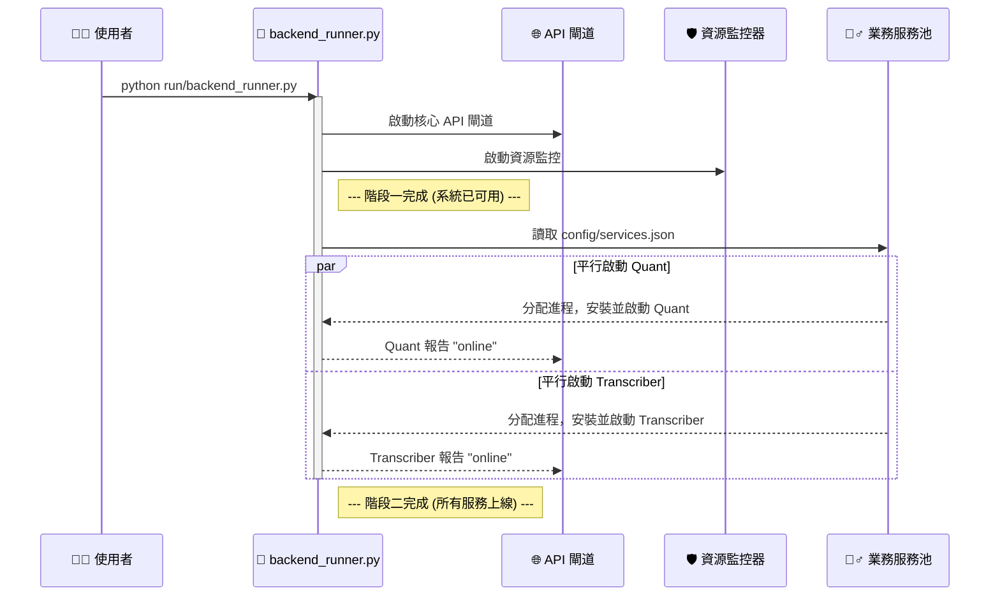

# 鳳凰之心 v13：彈性啟動與可觀測性架構

這份文件是專案 v13 的權威性技術藍圖。它闡述了一個以**彈性 (Resilience)** 和**可觀測性 (Observability)** 為核心的現代化微服務架構。

---

## 一、 設計哲學：從「能用」到「健壯」

v13 架構的設計，是為了解決前代系統在「啟動體驗」和「系統容錯」上的兩大核心痛點：

1.  **漫長的啟動等待 (Long Startup Times):** 傳統的循序啟動模式，要求所有服務（無論輕重）都成功啟動後，系統才算「就緒」。這導致使用者需要漫長等待，且任何一個非核心服務的失敗都會導致整個系統啟動失敗。
2.  **脆弱的整合 (Brittle Integration):** 前後端之間、服務與服務之間透過直接呼叫或共享狀態（如資料庫）來溝通。這種緊密耦合的關係，使得任何一個組件的失敗都可能引發連鎖反應，導致整個系統崩潰。

為此，我們確立了三大核心解決策略，它們共同構建了一個**快速回應、容錯性高、易於監控**的系統：

-   **策略一：分階段啟動 (Staged Loading)**
    我們將系統啟動過程拆分為兩個階段。**階段一**在幾秒內啟動最核心的 **API 閘道**，讓系統立刻「有反應」。**階段二**則在背景**平行地、非同步地**載入其他所有業務服務。這徹底改變了使用者體驗，並實現了服務間的故障隔離。

-   **策略二：統一 API 閘道 (Unified API Gateway)**
    所有外部請求（來自前端或其他客戶端）都必須透過一個**單一的、統一的 API 閘道 (`api_server`)**。這個閘道負責路由、認證和流量控制。後端的業務服務則隱藏在閘道之後，它們之間互不直接通訊，只與閘道溝通。這大大降低了系統的複雜度和耦合度。

-   **策略三：日誌流即狀態 (Log Stream as State)**
    我們摒棄了傳統的狀態資料庫。取而代之的是，系統中的**每一個事件**——從服務啟動、資源監控，到業務邏輯執行——都以標準化的 **JSON 格式**輸出到 `stdout`。這個日誌流本身就是系統**唯一且真實的狀態**。前端或任何監控系統的職責，就是消費這個日誌流，並從中呈現出它們所關心的狀態。

---

## 二、 v13 檔案結構與核心工具鏈

```
/PHOENIX_HEART_PROJECT/
│
├── 📂 apps/
│   ├── 🌐 api_server/             # - 【核心】統一 API 閘道
│   ├── 📈 quant/                  # - 量化金融 App
│   └── 🎤 transcriber/            # - 語音轉寫 App
│
├── 📂 run/
│   ├── 🚀 backend_runner.py       # - 【核心】純後端啟動編排器
│   └── 🏃 colab_runner.py        # - Colab 視覺化啟動器
│
├── 📂 utils/
│   └── 🛡️ resource_monitor.py    # - 高頻資源監控腳本
│
├── 📂 config/
│   └── ⚙️ services.json          # - 定義所有可啟動的業務服務
│
└── 📂 tests/
    └── 🧪 test_all.py              # - ✨【唯一】的整合測試腳本
```

### **核心工具鏈詳解:**

*   **`run/backend_runner.py`**: 專案的**心臟**。它是一個啟動編排器，負責實現我們的「分階段啟動」策略。
*   **`apps/api_server/`**: 專案的**門戶**。所有內外部通訊的唯一入口點。
*   **`config/services.json`**: 專案的**服務註冊中心**。定義了哪些服務是可用的，以及如何啟動它們。
*   **`utils/resource_monitor.py`**: 專案的**眼睛**。一個獨立的程序，持續不斷地將系統效能指標以 JSON 格式輸出到日誌流中。
*   **`tests/test_all.py`**: 專案的**品質守護者**。一個全面的整合測試，用於驗證整個架構的彈性和功能。

---

## 三、 全鏈路自動化流程圖 (v13)

這張圖描繪了從使用者啟動到所有服務上線的完整「分階段啟動」流程。



### **流程詳解:**

1.  **使用者啟動**: 使用者執行 `backend_runner.py`。
2.  **階段一：核心啟動 (毫秒級)**
    *   `backend_runner.py` **立即**啟動 `api_server` 和 `resource_monitor`。
    *   此時，API 閘道已經可以接受請求，資源監控也開始輸出日誌。系統在外部看來已經「活了」。
3.  **階段二：業務服務載入 (秒級/分鐘級)**
    *   `backend_runner.py` 讀取 `config/services.json` 來獲取所有需要啟動的業務服務列表。
    *   它使用一個**進程池 (`ProcessPoolExecutor`)**，為每一個業務服務分配一個獨立的進程。
    *   在各自的進程中，每個服務會**獨立地**建立自己的虛擬環境、安裝依賴，然後啟動。
    *   當一個服務成功啟動後，它會主動向 `api_server` **回報**自己的「上線」狀態。
4.  **前端呈現**
    *   與此同時，任何前端應用（如 `colab_runner.py`）都在持續地輪詢 `api_server` 的 `/status` 端點，或者直接讀取 `backend_runner.py` 的 stdout 日誌流。
    *   當它發現服務狀態變更時，就會即時更新自己的 UI。

這個架構的優雅之處在於，即使 `quant` 服務因為依賴問題需要 5 分鐘才能裝好，或者 `transcriber` 服務啟動失敗，**都不會影響到 `api_server` 的穩定運行和其他服務的載入**，從而實現了極高的系統彈性。
