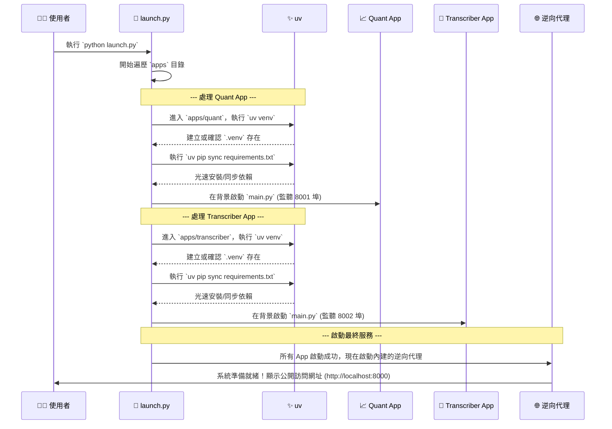

# 鳳凰之心：最終架構總藍圖

這份文件是我們綜合所有討論後得出的最終成果。它詳細描繪了專案的最終形態，涵蓋了檔案結構、業務邏輯劃分、使用的核心工具，以及完整的執行流程。

---

## 一、 核心理念與工具 (Core Philosophy & Tools)

我們的架構基於以下三大核心理念，並由一套精簡的工具鏈來實現：

- **微服務架構 (Microservices)**: 每個 App (`quant`, `transcriber`) 都是一個獨立、可自行運行的 FastAPI 服務。
- **完全隔離 (Total Isolation)**: 每個 App 擁有自己獨立的虛擬環境 (`.venv`)，由唯一的總開關 `launch.py` 自動管理，彼此絕不干擾。
- **聲明式環境 (Declarative Environments)**: 每個 App 的依賴由其自己的 `requirements.txt` 精確聲明，保證了環境的極速建立與可重複性。

### 核心工具鏈:

- **uv**: 我們唯一的環境管理與安裝工具。負責以極致速度建立虛擬環境 (`.venv`) 和同步 Python 套件。
- **`launch.py`**: 專案的「總開關」，負責協調所有工具，一鍵啟動整個系統。
- **逆向代理 (Reverse Proxy)**: 內建於 `launch.py` 中，是系統的統一流量入口，負責將請求轉發給對應的 App。
- **FastAPI**: 我們所有微服務使用的現代、高效能 Web 框架。

---

## 二、 終極檔案結構與業務邏輯歸屬

這是我們專案的最終檔案結構。它清晰地展示了每一個檔案的職責。

```
/PHOENIX_HEART_PROJECT/
│
├── 🚀 launch.py                 # 唯一的「總開關」。負責：
│                                 #  - 一般模式: 協調所有 App 的環境建立與啟動，並開啟逆向代理。
│                                 #  - 開發者模式 (`--dev`): 執行完整的自動化測試。
│
├── 📦 apps/                      # 【所有獨立微服務的家】
│   │
│   ├── 📈 quant/                 # 【量化金融 App - 一個完整的獨立專案】
│   │   │
│   │   ├── 🛰️ main.py             # App 的入口：啟動 FastAPI 伺服器，掛載 API 路由。
│   │   │
│   │   ├── 🧠 logic/             # 核心業務邏輯層
│   │   │   ├── data_sourcing.py  # 數據源邏輯 (FinMind, FRED, yfinance)
│   │   │   ├── factor_engineering.py # 因子工程邏輯 (MA, RSI)
│   │   │   ├── analysis.py       # 分析與策略邏輯 (回測服務)
│   │   │   └── database.py       # 數據庫邏輯 (SQLite Manager)
│   │   │
│   │   ├── 🕸️ api/                # API 接口層
│   │   │   └── v1/
│   │   │       └── routes.py     # 定義所有 FastAPI 路由 (/backtest)
│   │   │
│   │   ├── 📜 requirements.txt     # **此 App 專屬的依賴清單**
│   │   ├── 🧪 tests/             # **此 App 專屬的**單元與整合測試
│   │   └── .venv/                # (由 launch.py 自動生成) 獨立的虛擬環境
│   │
│   └── 🎤 transcriber/           # 【語音轉寫 App - 一個完整的獨立專案】
│       │
│       ├── 🛰️ main.py             # App 的入口：啟動 FastAPI 伺服器
│       │
│       ├── 🧠 logic.py           # 核心業務邏輯 (呼叫轉寫模型)
│       │
│       ├── 📜 requirements.txt     # 核心依賴
│       ├── 📜 requirements.large.txt # (可選) 大型依賴，用於真實模式測試
│       ├── 🧪 tests/             # **此 App 專屬的**單元與整合測試
│       └── .venv/                # (由 launch.py 自動生成) 獨立的虛擬環境
│
├── ⚙️ proxy/                      # 【逆向代理配置】
│   └── proxy_config.json       # 定義路由規則 (e.g., "/quant" -> "localhost:8001")
│
├── 📚 docs/                       # 【專案文件】
│   └── ARCHITECTURE.md         # (本文件) 最終的架構設計總藍圖
│
└── 🗄️ ALL_DATE/                 # 【封存參考資料】存放舊專案作為開發參考
```

---

## 三、 統一啟動與執行流程

系統的啟動與測試完全由 `launch.py` 這個總開關控制。

### 一般模式 (用於部署與手動操作)

當您執行 `python launch.py` 時，系統會進入**一般模式**，嚴格遵循以下流程：



### 流程總結：

1.  **啟動器 (`launch.py`)** 是唯一的指揮官。
2.  它逐一「拜訪」每個 App 的家 (`apps/*`)。
3.  在每個家裡，它命令 **uv** 快速建立一個獨立、標準化的工作環境 (`.venv`) 並安裝好所有工具 (`requirements.txt`)。
4.  環境就緒後，它就讓這個 App 自己開始工作（在背景運行自己的 FastAPI 伺服器）。
5.  當所有 App 都開始獨立工作後，啟動器最後會打開「總服務台」（逆向代理），讓外界可以開始通過統一的入口訪問所有服務。

這套流程確保了無論在何種環境下，整個系統的啟動過程都是標準化、可預測、且極度高效的。

### 開發者模式 (用於自動化測試)

當您執行 `python launch.py --dev` 時，系統會進入**開發者模式**。在此模式下，它將：

1.  **逐一測試每個 App**:
    -   為 App 建立一個**隔離的測試虛擬環境** (`.venv_test`)。
    -   安裝所有依賴，包括核心依賴 (`requirements.txt`) 和大型依賴 (`requirements.large.txt`)。
    -   執行 `Ruff` 進行程式碼品質檢查。
    -   執行 `pytest` 運行所有單元和整合測試。
    -   測試完成後，**自動刪除測試虛擬環境**，保持專案目錄的乾淨。
2.  **提供總結報告**:
    -   如果所有 App 的測試都通過，腳本將以狀態碼 `0` 成功退出。
    -   如果有任何一個測試失敗，腳本將以狀態碼 `1` 退出。

這個模式是為了**持續整合 (CI)** 和本地快速驗證而設計的，它提供了一個單一、可靠的命令來保證整個專案的品質。
