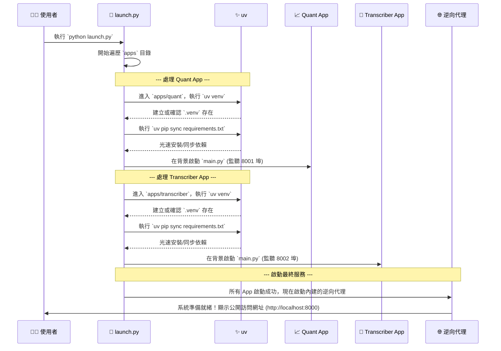

# 鳳凰之心：最終架構總藍圖

這份文件是我們綜合所有討論後得出的最終成果。它詳細描繪了專案的最終形態，涵蓋了檔案結構、業務邏輯劃分、使用的核心工具，以及完整的執行流程。

---

## 一、 核心理念與工具 (Core Philosophy & Tools)

我們的架構基於以下三大核心理念，並由一套精簡的工具鏈來實現：

- **微服務架構 (Microservices)**: 每個 App (`quant`, `transcriber`) 都是一個獨立、可自行運行的 FastAPI 服務。
- **完全隔離 (Total Isolation)**: 每個 App 擁有自己獨立的虛擬環境 (`.venv`)，由唯一的總開關 `launch.py` 自動管理，彼此絕不干擾。
- **聲明式環境 (Declarative Environments)**: 每個 App 的依賴由其自己的 `requirements.txt` 精確聲明，保證了環境的極速建立與可重複性。

### 核心工具鏈:

- **uv**: 我們唯一的環境管理與安裝工具。負責以極致速度建立虛擬環境 (`.venv`) 和同步 Python 套件。
- **`launch.py`**: 專案的「總開關」，負責協調所有工具，一鍵啟動整個系統。
- **逆向代理 (Reverse Proxy)**: 內建於 `launch.py` 中，是系統的統一流量入口，負責將請求轉發給對應的 App。
- **FastAPI**: 我們所有微服務使用的現代、高效能 Web 框架。

---

## 二、 終極檔案結構與業務邏輯歸屬

這是我們專案的最終檔案結構。它清晰地展示了每一個檔案的職責。

```
/PHOENIX_HEART_PROJECT/
│
├── 🚀 launch.py                   # 唯一的「總開關」，一鍵啟動所有服務。
├── 🚀 phoenix_starter.py          # 視覺化的「鳳凰之心指揮中心」啟動器。
│
├── 📦 apps/                        # 【所有獨立微服務的家】
│   │
│   ├── 📈 quant/                   # 【量化金融 App】
│   │   ├── 🛰️ main.py               # FastAPI 應用主入口。
│   │   ├── 🧠 logic/               # 核心業務邏輯。
│   │   │   ├── analysis.py         # 分析計算模組。
│   │   │   ├── data_sourcing.py    # 數據源處理模組。
│   │   │   ├── database.py         # 資料庫互動模組。
│   │   │   └── factor_engineering.py # 因子工程模組。
│   │   ├── 🕸️ api/                  # API 接口層。
│   │   │   └── v1/                 # API 版本 v1。
│   │   │       └── endpoints.py    # API 端點定義。
│   │   └── 📜 requirements.txt       # Python 核心依賴。
│   │
│   └── 🎤 transcriber/             # 【語音轉寫 App】
│       ├── 🛰️ main.py               # FastAPI 應用主入口。
│       ├── 🧠 logic.py             # 核心業務邏輯。
│       ├── 📜 requirements.txt       # Python 核心依賴。
│       └── 📜 requirements.large.txt # (可選) 大型 AI 模型依賴。
│
├── 🧪 tests/                       # 【品質保證中心：所有測試的家】
│   │
│   ├── 📈 quant/                   # 【量化金融 App 的測試】
│   │   └── test_api.py           # API 層級的整合測試。
│   │
│   └── 🎤 transcriber/             # 【語音轉寫 App 的測試】
│       └── test_api.py           # API 層級的整合測試 (包含模擬與 E2E)。
│
├── ⚙️ proxy/                        # 【逆向代理配置】
│   └── proxy_config.json         # 路由規則設定檔，定義如何轉發請求。
│
├── 📜 smart_e2e_test.sh           # 智能測試指揮官腳本。
│
├── 📚 docs/                         # 【專案文件】
│   ├── ARCHITECTURE.md           # (本文件) 最終的架構設計總藍圖。
│   ├── Colab_Guide.md            # 在 Google Colab 上運行的指南。
│   ├── MISSION_DEBRIEFING.md     # 專案的任務報告與總結。
│   └── TEST.md                   # 關於測試策略的詳細說明。
│
├── 🗄️ ALL_DATE/                   # 【封存參考資料】
│   └── ...                       # (包含多個舊專案與參考資料，此處省略)
│
└── 📄 .gitignore                  # Git 忽略檔案設定。
```

---

## 三、 統一啟動與執行流程

當您在任何環境執行 `python launch.py` 時，系統將嚴格遵循以下流程：



### 流程總結：

1.  **啟動器 (`launch.py`)** 是唯一的指揮官。
2.  它逐一「拜訪」每個 App 的家 (`apps/*`)。
3.  在每個家裡，它命令 **uv** 快速建立一個獨立、標準化的工作環境 (`.venv`) 並安裝好所有工具 (`requirements.txt`)。
4.  環境就緒後，它就讓這個 App 自己開始工作（在背景運行自己的 FastAPI 伺服器）。
5.  當所有 App 都開始獨立工作後，啟動器最後會打開「總服務台」（逆向代理），讓外界可以開始通過統一的入口訪問所有服務。

這套流程確保了無論在何種環境下，整個系統的啟動過程都是標準化、可預測、且極度高效的。
