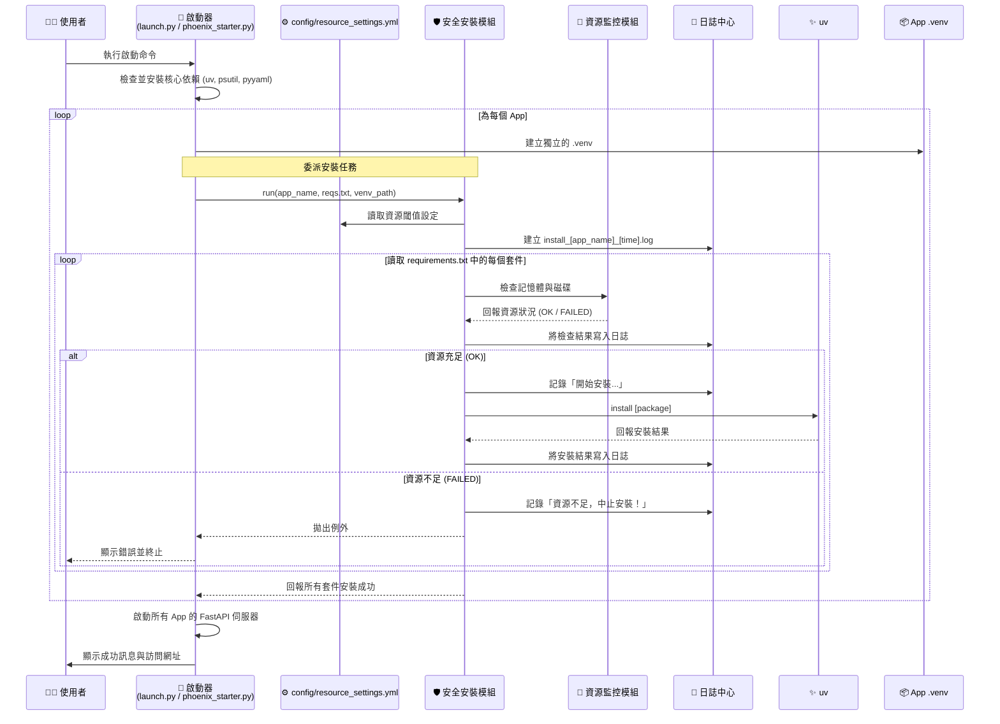

# 鳳凰之心 v9.1：最終架構總藍圖

這份文件是我們綜合所有討論後得出的最終成果。它詳細描繪了專案的最終形態 v9.1，涵蓋了檔案結構、智慧型安裝流程、以及核心工具的協同工作方式。

---

## 一、 核心理念與工具 (Core Philosophy & Tools)

我們的架構基於以下四大核心理念：

- **微服務架構 (Microservices)**: 每個 App (`quant`, `transcriber`) 都是一個獨立、可自行運行的 FastAPI 服務。
- **完全隔離 (Total Isolation)**: 每個 App 擁有自己獨立的虛擬環境，由主啟動腳本自動管理，彼此絕不干擾。
- **聲明式環境 (Declarative Environments)**: 每個 App 的依賴由其自己的 `requirements.txt` 精確聲明。
- **智慧型資源管理 (Intelligent Resource Management)**: 在安裝**每一個**套件前，系統都會即時檢查記憶體與磁碟資源，確保不會因資源耗盡而中斷，並將所有操作記錄在案。

### 核心工具鏈:

- **`phoenix_starter.py`**: 視覺化啟動器。
- **`launch.py`**: 主啟動腳本 (無介面)。
- **`core_utils/safe_installer.py`**: 安全安裝模組。
- **`core_utils/resource_monitor.py`**: 資源監控模組。
- **`config/resource_settings.yml`**: 全域設定中心。
- **`logs/`**: 日誌中心。
- **uv**: 底層安裝工具。
- **FastAPI**: Web 框架。

---

## 二、 終極檔案結構與業務邏輯歸屬 (v9.1)

這是我們專案的最終檔案結構。它清晰地展示了每一個檔案的職責。

```
/PHOENIX_HEART_PROJECT/
│
├── 🚀 phoenix_starter.py          # 【推薦】視覺化啟動器，整合所有功能。
├── 🚀 launch.py                   # 【無介面】主啟動腳本，適合伺服器環境。
├── 📜 smart_e2e_test.sh           # 智能測試腳本，由安全安裝模組驅動。
│
├── 📦 apps/                        # 【所有獨立微服務的家】
│   ├── 📈 quant/                   #  - 量化金融 App
│   └── 🎤 transcriber/             #  - 語音轉寫 App
│       └── ... (每個 App 內部包含 main.py, logic, requirements.txt 等)
│
├── 🛠️ core_utils/                 # 【核心工具模組】
│   ├── __init__.py               #  - 將此目錄標記為 Python 套件。
│   ├── 🔬 resource_monitor.py      #  - 資源監控模組：提供檢查系統資源的函式。
│   └── 🛡️ safe_installer.py       #  - 安全安裝模組：逐一套件、帶資源檢查地執行安裝。
│
├── ⚙️ config/                     # 【全域設定中心】
│   └── resource_settings.yml     #  - 在此定義記憶體/磁碟閾值等監控參數。
│
├── 📝 logs/                        # 【日誌中心】
│   └── .gitkeep                  #  - 所有安裝與啟動日誌的存放處 (log檔會被自動忽略)。
│
├── 🧪 tests/                       # 【品質保證中心】
│   ├── 📈 quant/                   #  - 量化金融 App 的測試。
│   └── 🎤 transcriber/             #  - 語音轉寫 App 的測試。
│
├── ⚙️ proxy/                        # 【逆向代理配置】
│   └── proxy_config.json         #  - 路由規則設定檔。
│
├── 📚 docs/                         # 【專案文件】
│   └── ARCHITECTURE.md           #  - (本文件) 深入的架構設計藍圖。
│
└── 📄 .gitignore                  # Git 忽略檔案設定。
```

---

## 三、 智慧型啟動與安裝流程

當您執行 `python launch.py` 或 `python phoenix_starter.py` 時，系統將嚴格遵循以下更為精密的流程：



### 流程總結：

1.  **啟動器 (Starter)** 負責高層協調，它首先確保 `uv`, `psutil`, `pyyaml` 等核心工具已就緒。
2.  對於每個微服務 App，啟動器不再親自執行安裝，而是將任務**委派**給**安全安裝模組 (`safe_installer.py`)**。
3.  **安全安裝模組**接手後：
    a.  首先從**設定中心 (`config.yml`)** 讀取最新的資源監控標準。
    b.  然後為這次安裝任務在**日誌中心 (`logs/`)** 中建立一個專屬的日誌檔案。
    c.  它**逐一**讀取 `requirements.txt` 中的套件，而不是一次性全部處理。
    d.  在安裝**每一個**套件前，它都會命令**資源監控模組 (`resource_monitor.py`)** 進行一次全面的資源健康檢查。
    e.  所有檢查和安裝步驟，無論成功或失敗，都會被詳細地記錄在日誌檔案中。
    f.  如果任何一步資源檢查失敗，安裝模組會立即中止任務並拋出錯誤，防止系統崩潰。
4.  只有當所有 App 的依賴都安全安裝完畢後，啟動器才會繼續執行後續的服務啟動流程。

這套流程將原本簡單的安裝過程，升級為一個具備**容錯、監控、可追溯、可配置**能力的專業級部署系統。
